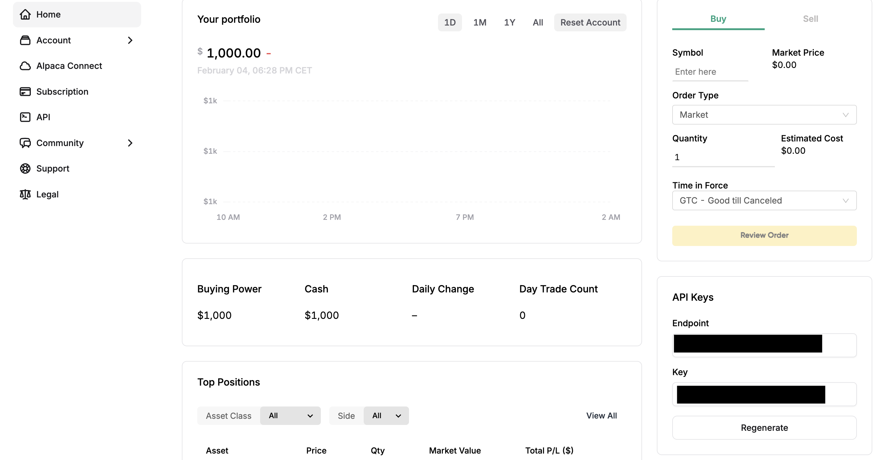

# Getting started

## Requirements

* Docker and docker-compose
  * A guide can be found [here](https://docs.docker.com/get-docker/)
* Ollama (for sentiment analysis)
  * Currently only available on MacOS and Linux (as is). Can be run on windows with WSL and docker
  * [Download](https://ollama.ai/) - For Linux and MacOS
  * For Windows WSL follow the Linux section of this [guide](https://ollama.ai/blog/ollama-is-now-available-as-an-official-docker-image)
* GPT4ALL (alternative for sentiment analysis) (Available on all platforms)
  * [Download](https://gpt4all.io/index.html)

## Starting Ollama

For the platform to be able to interact with Ollama, it needs to be started by running 
the following command in your terminal:

```bash
export OLLAMA_HOST=0.0.0.0 && ollama serve
```

### Starting GPT4ALL

If you decide to use GPT4ALL as a local LLM provider, use the following guide to start the HTTP server associated with it: [Guide](https://docs.gpt4all.io/gpt4all_chat.html#server-mode)

## Downloading the platform

To download the platform you first need to have Git installed ([guide](https://git-scm.com/downloads)).

Once you have Git ready, simply run the following command:

```bash
git clone https://github.com/raulfrk/OpenTradingPlatform.git
```

This will clone the OTP repo on your local computer.

## Generating an API Key on Alpaca and setting it on OTP

Inside the repository that you just cloned, there is a `.env` file. In this file
you will find all crucial configurations needed for the platform to run.

In particular, you should configure the ALPACA_KEY and ALPACA_SECRET:

```
# OLLAMA_SERVER_URL indicates the URL of the Ollama server
# If in a docker container, use the name of the service
# If running on the host machine, use "host.docker.internal" 
# E.g. http://host.docker.internal:11434
# (make sure that when you start ollama, you set the IP to 0.0.0.0:11434)
OLLAMA_SERVER_URL=http://host.docker.internal:11434
# ALPACA KEY and SECRET are the API key and secret for Alpaca
ALPACA_KEY=XXxXxXxXxXxXx
ALPACA_SECRET=XXxXxXxXxXxXxXxXxXxXxXxXxXxXxXx
# NATS_URL is the URL of the NATS server
NATS_URL=nats://nats:4222
```

Once modified, the file should look similar to this, with the XxXx of the ALPACA_KEY and ALPACA_SECRET replaced with your personal values.

You can get your API Keys in the left corner of the Alpaca dashboard.


## Building the platform

Before starting the platform you need to build the docker images used to start the docker containers.

In the OpenTradingPlatform folder, run the following command in the terminal:

```bash
docker-compose build
```

## Starting the platform

To start the platform, once the build process is completed, run the following command in the terminal:

```
docker-compose up
```

At this point if you don't get any error messages indicating that any container crashed, the platform is correctly running.

To stop it run:

````
docker-compose down
```

